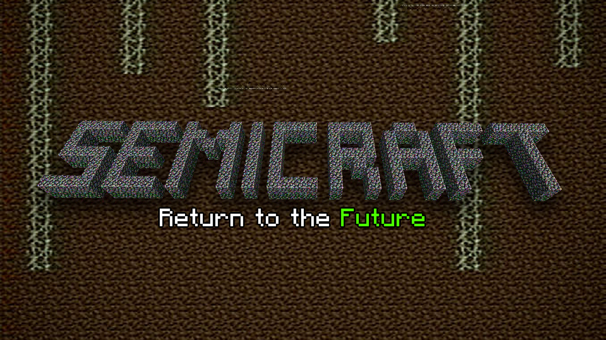

> 🌐 [[en/index|English version]]

# Semicraft

**Semicraft** — ARG о Minecraft-сервере, «заражённом» багами. Проект начался в **2015** году; сервер закрывался из‑за аномалий в **2015** и **2020**, затем снова открылся. Сейчас **2026** год — баги и странности продолжаются.

Публичный исследовательский сервер с элементами мистики, визуально имитирующий ранние альфа-версии Minecraft.

## Подключение к серверу

| Параметр | Данные для входа |
| --- | --- |
| **IP-адрес** | `45.157.232.7:21015` |
| **Версия** | 1.21.1 (стилизация под Alpha) |
| **Доступ** | Whitelist — заявка на [mahazeviet@gmail.com](mailto:mahazeviet@gmail.com) |

## Официальные ресурсы

- **Сайт:** [semicraft.su](http://semicraft.su) — клик по логотипу открывает [[lore/Терминал|терминал]]
- **Discord сообщества:** [discord.gg/9E3x6EbcA8](https://discord.gg/9E3x6EbcA8)
- **Discord HanoiHaze:** [discord.gg/2sx9KpsuH3](https://discord.gg/2sx9KpsuH3)
- **FAQ:** [[guides/FAQ|FAQ по подключению]]
- **Архив MWD:** *(см. [[lore/Архив MWD|описание архива]])*

# База знаний

## Лор и системы

- [[lore/Введение|Введение в лор]]
- [[lore/Терминал|Терминал semicraft.su]]
- [[lore/C.Y.|C.Y.]] · [[lore/C.I.|C.I.]]
- [[lore/Ритуалы|Ритуалы]] · [[lore/Пустота|Пустота]]
- [[lore/Community Footage|Записи сообщества]]

## Аномалии

- [[anomalies/index|Реестр аномалий]]
- [[anomalies/Вирус|Вирус]] · [[anomalies/Star|Star (Звёзды)]]
- [[anomalies/Armorstand|Armor Stand]] · [[anomalies/Контроль игрока|Контроль игрока]]

## Люди и места

- [[players/index|База игроков и персонажей]]
- [[locations/Спавн|Спавн]] · [[locations/Локации|Локации]]

## Справка

- [[rules/Правила|Правила]] · [[guides/FAQ|FAQ]]
- [[guides/Декодирование|Инструменты декодирования]]
- [[site/Сайт Semicraft|Сайт и терминал — полный справочник]]
